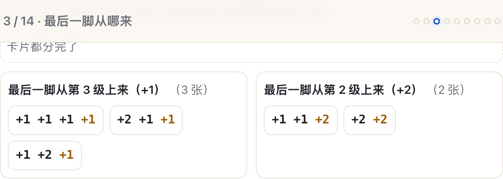
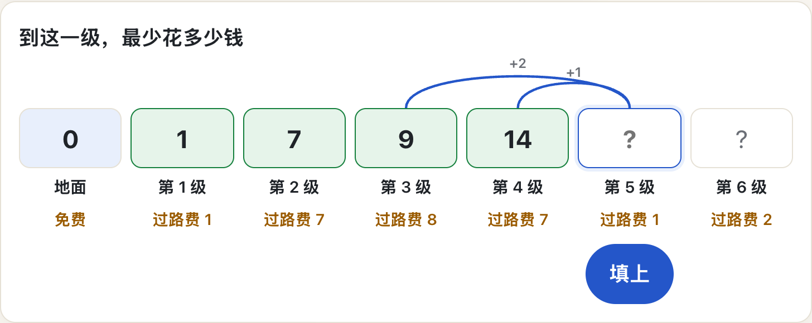

# FunAl · 动态规划，从一段楼梯开始

一个**循循善诱**的互动教程，教任何人理解动态规划（Dynamic Programming, DP）。
零基础可学：不背公式，先亲手做、亲手数、亲手算，再给你做过的事起名字。

- 单文件网页：下载 `index.html`，双击即可在浏览器打开，无需安装任何东西。
- 每一屏像一次面对面辅导：导师问一句，你动手答一句；答错有针对你那个错法的解释，卡住有三级提示。
- 可选的 AI 导师（Kimi）：用你自己的话提问，它只反问、只提示，不代替你思考。**没有它，课程也完整可用。**





## 这门课教什么

一段 6 级的楼梯，每次上 1 级或 2 级。从「一共有几种走法」开始，你会依次亲手做出：

- **只看最后一步**，把一个大问题拆成同类的小问题（并且亲手验证这样拆不重不漏）；
- **起步格**为什么是那个数（用你自己推出的规律反推出来，不是背的）；
- 照着规律往下问会**爆炸**（30 级楼梯要问 269 万次），给它一个账本就只剩 29 次；
- 倒过来**从小到大填表**，和上面是同一本账；
- 换成「最少花多少钱」，**加号变成挑小的**；
- 什么时候这套办法**会失灵**（一条新规则让表算出一个买不到的价钱）；
- 最后独立做完一道跟楼梯毫无关系的题（凑硬币）。

术语（状态、转移、边界、记忆化、递推）到第 8 屏才出现，而且只是给你已经做过的事贴标签。

| # | 这一屏 | 学习者在这一屏做什么 |
|---|--------|--------------------|
| 1 | **先押一个数** | 让学习者知道这门课要干什么，并留下一个属于自己的猜测，供后面对账。 |
| 2 | **亲手数一数** | 让学习者亲手枚举出到第 4 级的 5 条走法，并确认「顺序不同就是不同走法」。 |
| 3 | **最后一脚从哪来** | 学习者亲手把 5 条路线按最后一步分成两堆，双向验证不重不漏，剪掉最后一步后看到两堆正好是两道更小的同类题。 |
| 4 | **还有别的分法吗** | 学习者亲手用另外两种方式分堆，看到「按第一脚分」需要一个额外前提、「按用了几个 2 分」当场崩掉，从而拿到真正的判据。 |
| 5 | **第 0 级填几** | 让学习者用刚推出的规律反推出「到第 0 级 = 1」，而不是被告知；并用规律算到第 6 级，跟开场的猜测对账。 |
| 6 | **一台没记性的机器** | 学习者亲手把「从上往下问」的过程展开，亲眼看到同一道小题被反复问，并感受到楼梯变高时的爆炸。 |
| 7 | **给它一个账本** | 学习者亲手用账本重跑一遍，看到真正需要算的小题只有几道，并理解「记下来」为什么可信。 |
| 8 | **给做过的事起名字** | 把学习者已经做过的五件事命名，解释符号怎么读，并说清「动态规划」这个名字的来历。 |
| 9 | **换一道题：过路费** | 让学习者在同一段楼梯上亲手试路，撞上两个直觉陷阱，发现「凭感觉走」和「躲开最贵的」都不可靠。 |
| 10 | **加号变成挑小的** | 让学习者自己选出「挑小的再加本级费用」，并弄清计数题为什么不加代价、最优化题为什么要加。 |
| 11 | **凭什么信小格子** | 让学习者亲手把一条路的前半段换掉，看到后半段一分不变；再用一条新规则让这套办法当场失灵，得到「什么时候能用」的判据。 |
| 12 | **自己填最省表** | 学习者独立填完整张最省表，然后亲手把最省路线倒着找回来；并处理两个来路一样小的情况。 |
| 13 | **一道新题：凑硬币** | 学习者用四问清单独立解一道和楼梯毫无关系的题，并处理「凑不出来」的格子。 |
| 14 | **带走一张清单** | 让学习者回看自己走过的路，把四问排成清单，并在三道没见过的题上只做「认题」练习。 |

全程 **35–45 分钟**，取决于你在每一屏想多久。**随时可以关掉**，进度存在浏览器里，下次打开接着学；顶部「目录」可以跳到任意一屏。

每一屏都要动手。答错不会只说「不对」，而是解释你那个想法错在哪；卡住有三级提示，提示用完还是不会，可以直接看答案继续往下走——**没人会被卡在一屏上出不去。**


## 直接学

**打开就能学：<https://yongxie-icmm.github.io/FunAl/>**

想离线用，就下载 [`index.html`](index.html) 双击打开——不需要联网，不需要安装任何东西。进度存在浏览器里，随时可以关掉，下次接着学。

## 开启 AI 导师（可选）

AI 导师通过一个本机小服务调用 Kimi（Moonshot）API。**API 密钥只存在你的电脑上，不会进入网页，也不会进入这个仓库。**

```bash
cp .env.example .env        # 然后把 KIMI_API_KEY 换成你自己的密钥（.env 已被 .gitignore 忽略）
python3 mentor_server.py    # 打开 http://127.0.0.1:8765
```

- 只需要 Python 3.8+，不依赖第三方库。
- 也可以用环境变量 `KIMI_API_KEY`、`KIMI_BASE_URL`、`KIMI_MODEL`，或 `--env-file` 指定别处的配置文件。
- `python3 mentor_server.py --no-ai` 只提供网页、不接 AI。
- 页面只在 `localhost` 上去找导师服务。如果你把它跑在别的地址上，在网址后面加 `?mentor=1`。
- 导师的教学规则写在 [`mentor_prompt.md`](mentor_prompt.md)，可以自己改。

## 修改与打包

源码在 `src/`：`engine.js` 是对话式辅导引擎，`levels/` 里每个文件是一屏，`styles.css` 是样式。

```bash
python3 build.py            # 把 src/ 打包成单文件 index.html
```

`design/lesson_spec.md` 是逐屏教学脚本（学习目标、每句文案、每个错误答案的反馈、分级提示）。改课程先改脚本，再改对应的 level 文件。

## 许可

MIT。见 [LICENSE](LICENSE)。
